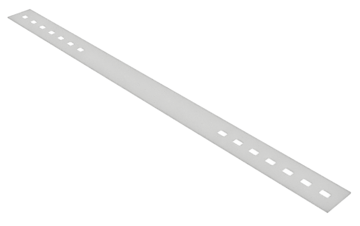

# Rubber band
The rubber band keeps the shield in place. It is in contact with skin and hair and as such, should be safe and comfortable to wear. 

# Design decissions
- Silicone rubber was chosen because it is highly inert and generally considerd not to irritate the skin nor create allergic reactions. 
- 1mm thick material was easily obtainable for us and proved to be strong enough. We have not experimented with other thicknesses. 
- The corners of the holes were slightly rounded. This almost doubled the strength of the band. 

# Laser cut pattern
The pattern is provided as a DXF file generated from the design file(s). The DXF file is already compensated for a kerf of 0.15mm. This is the typical kerf for a correctly set up CO2 laser in silicone rubber. Small differences in kerf width will not change the functionality. However, the user is adviced to check this. 

# Design files
This part was designed in Fusion 360. The latest 'production-ready' source is provided as Fusion 360 f3d file and STEP file. 

# Set-up sheet / Lightburn file
The provided Lightburn file contains the program we use to cut 25 bands from a 505mm x 305mm sheet of Silicone Rubber. It can be used as a basis for your setup, but will likely need to be changed 
