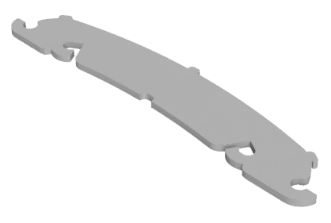

# Laser cut pattern
The pattern is provided as a DXF file generated from the design file(s). The DXF file is already compensated for a kerf of 0.45mm, which is assumed to be typical for cutting HDPE. However, the user is adviced to verify this assumption. 

# Design files
This part was designed in Fusion 360. The latest 'production-ready' source is provided as Fusion 360 f3d file and STEP file. 
